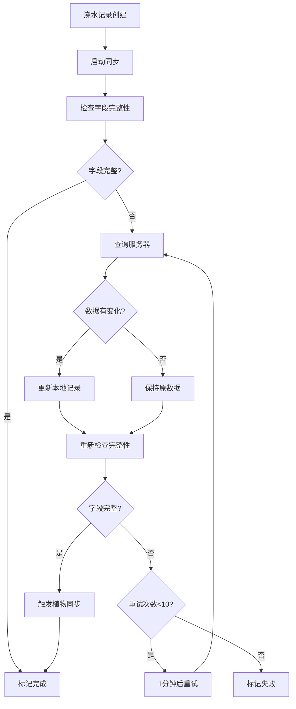
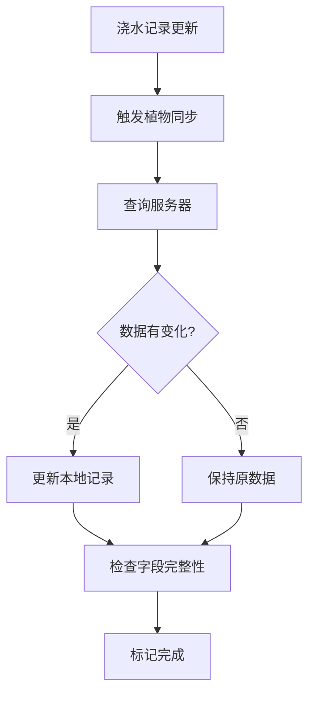

# 新同步机制文档

## 概述

新的同步机制采用了更简洁高效的设计，专注于浇水记录的字段完整性检查和植物记录的联动同步。

## 核心特性

### 1. 浇水记录优先同步
- **字段完整性检查**：检查 `memoryText`、`emotionTags`、`emotionIntensity`、`coreEvent` 字段
- **1分钟重试间隔**：字段不完整的记录每1分钟查询一次
- **最多10次重试**：超过10次后停止自动重试，标记为失败
- **自动启动**：浇水记录创建后自动启动同步

### 2. 植物记录联动同步
- **触发条件**：当浇水记录更新且数据有变化时触发
- **字段完整性检查**：检查 `currentGrowthStage`、`growthValue`、`personalityTags`、`lastWateringTime` 字段
- **单次同步**：植物记录不进行重试，失败后标记为失败状态

### 3. 简化的同步指示器
- **隐藏逻辑**：只有存在失败的同步记录时才显示
- **失败计数**：显示失败的记录数量
- **一键重试**：点击指示器可重试所有失败的同步

## 技术实现

### 同步状态字段

```typescript
interface SyncStatus {
  lastSync: number          // 最后同步时间
  isComplete: boolean       // 字段是否完整
  isSyncing: boolean        // 是否正在同步
  error?: string           // 错误信息
  retryCount?: number      // 重试次数
  maxRetries?: number      // 最大重试次数
  nextRetryTime?: number   // 下次重试时间
  isFailed?: boolean       // 是否已失败
  lastModified?: number    // 最后修改时间
}
```

### 核心服务方法

#### `startWateringRecordSync(recordId: string)`
启动浇水记录的自动同步，检查字段完整性并设置重试机制。

#### `syncSingleWateringRecord(recordId: string)`
同步单个浇水记录，检查数据变化并触发植物同步。

#### `syncSinglePlant(plantId: string)`
同步单个植物记录，检查字段完整性。

#### `getFailedSyncCount()`
获取失败的同步记录数量。

#### `restartPendingSyncs()`
重启所有待处理的同步任务（应用启动时调用）。

## 使用方法

### 1. 浇水记录创建后启动同步

```typescript
import { startWateringRecordSync } from '@/services/syncService'

// 创建浇水记录后
addWateringRecord(localRecord)
startWateringRecordSync(localRecord.id)
```

### 2. 使用同步钩子

```typescript
import { useSmartSync, useWateringRecordSync } from '@/hooks/useSmartSync'

// 全局同步状态
const { syncState, startWateringSync, retryFailedSyncs } = useSmartSync()

// 单个浇水记录同步状态
const { isSyncing, isComplete, isFailed, retryCount } = useWateringRecordSync(recordId)
```

### 3. 同步指示器组件

```typescript
import SyncStatusIndicator from '@/components/SyncStatusIndicator'

// 只在有失败记录时显示
<SyncStatusIndicator />
```

## 同步流程

### 浇水记录同步流程



### 植物记录同步流程



## 性能优化

### 1. 内存管理
- 使用 Map 缓存同步 Promise，避免重复请求
- 及时清理定时器，防止内存泄漏
- 应用关闭时清理所有定时器

### 2. 网络优化
- 避免重复的同步请求
- 数据变化检测，只在有变化时更新
- 批量处理重试操作

### 3. 用户体验
- 延迟执行植物同步，避免阻塞浇水流程
- 智能显示同步指示器
- 提供一键重试功能

## 错误处理

### 1. 网络错误
- 自动重试机制
- 指数退避（通过固定1分钟间隔实现）
- 最大重试次数限制

### 2. 数据错误
- 字段完整性验证
- 数据变化检测
- 错误状态记录

### 3. 应用状态
- 启动时重置卡住的同步状态
- 网络恢复时重启待处理同步
- 定时器清理和恢复

## 配置选项

```typescript
const SYNC_CONFIG = {
  WATERING_RETRY_INTERVAL: 60 * 1000, // 1分钟重试间隔
  MAX_RETRY_COUNT: 10,                 // 最大重试次数
  BATCH_SIZE: 5,                       // 批量同步大小
}
```

## 迁移指南

### 从旧同步机制迁移

1. **移除复杂的退避算法**：不再需要指数退避相关代码
2. **简化同步状态**：移除 `backoffLevel`、`nextSyncTime` 等字段
3. **更新调用方式**：使用 `startWateringRecordSync` 替代 `markEntityModified`
4. **更新指示器逻辑**：只在失败时显示，移除常驻显示

### 兼容性注意事项

- 旧的同步状态数据会在应用启动时自动清理
- 新的字段完整性检查可能会触发更多的同步请求
- 同步指示器的显示逻辑发生变化

## 监控和调试

### 日志输出
- 同步开始和完成日志
- 字段完整性检查结果
- 重试次数和失败原因
- 定时器创建和清理

### 调试工具
- `getFailedSyncCount()` 获取失败数量
- `hasPendingSync()` 检查是否有进行中的同步
- 浏览器开发者工具查看定时器状态

## 最佳实践

1. **及时启动同步**：浇水记录创建后立即调用 `startWateringRecordSync`
2. **监控失败状态**：定期检查 `syncState.failedCount`
3. **提供重试机制**：在UI中提供重试失败同步的入口
4. **合理的错误提示**：向用户展示同步状态和错误信息
5. **性能监控**：关注同步频率和网络请求数量
